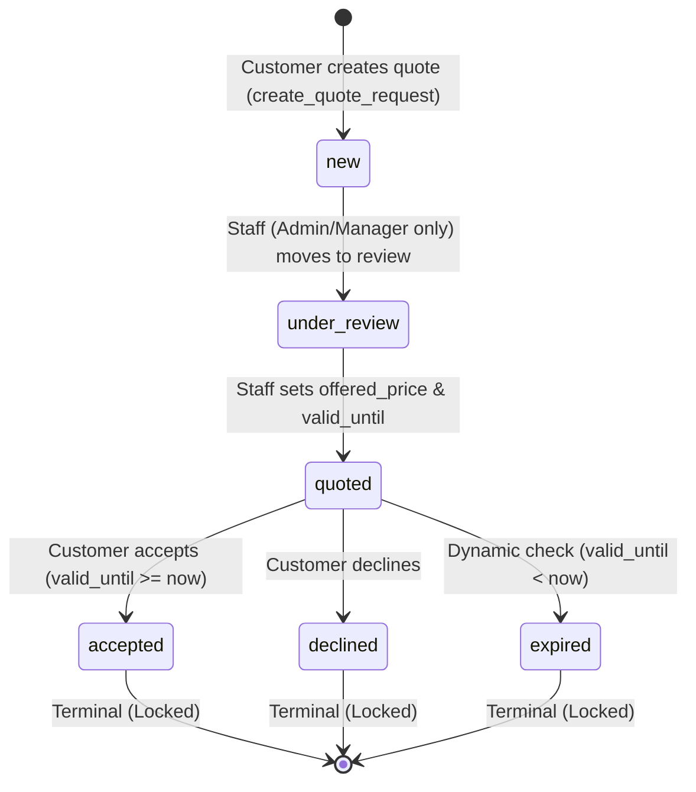
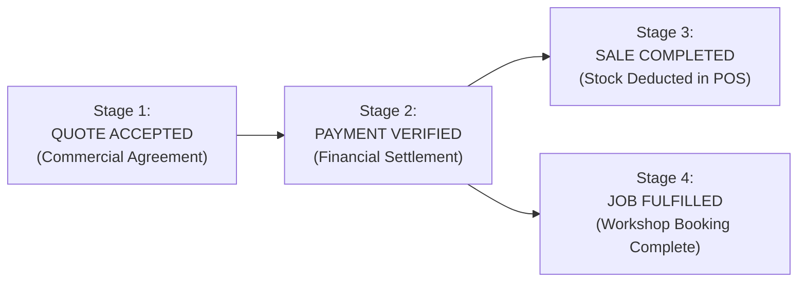
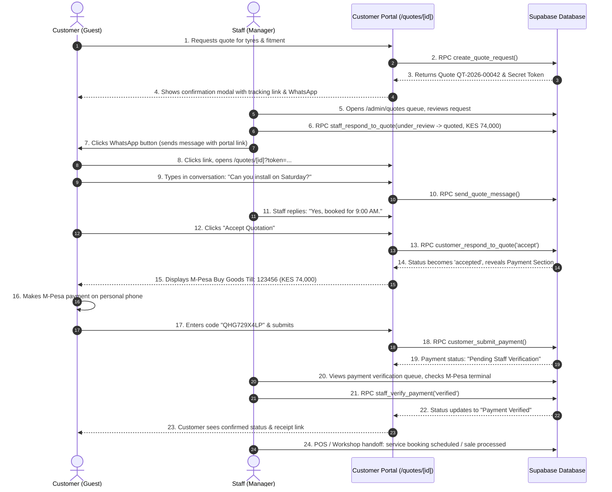

# V0.6 — Quote-to-Payment & Customer Portal Architecture Specification

> **Document Status**: Certified Architecture Specification (GATE 033 Updates Applied)  
> **Milestone**: V0.6 (Quote-to-Payment & Customer Portal — Phase V0.6A Implementation)  
> **Target Release**: Well Lups Auto Tyres Limited Commercial Platform  
> **Authority**: Current deployed codebase, PostgreSQL schema, RLS policies, and Vitest/Playwright regression suites.  
> **System of Record Rule**: Well Lups Quote Portal & Database = Sole Authoritative Commercial System of Record. WhatsApp = Notification & Support Channel Only (Never the commercial record).

---

## BUSINESS DECISIONS — LOCKED (GATE 033 Sign-Off)

1. **PAYMENT (100% Full Payment Required)**:
   * Customers must pay **100%** of the accepted/agreed quote amount.
   * **NO** deposit or partial payment model in V0.6.
   * A payment is considered sufficient only when the full required amount has been verified.
   * Split payments, deposits, instalments, or partial settlements are strictly forbidden.

2. **M-PESA TRANSACTION REFERENCE (10-Character Alphanumeric Regex)**:
   * Customer-entered M-Pesa transaction reference must be **exactly 10 alphanumeric characters**.
   * Accepted character set: `A-Z`, `0-9`.
   * Input must be trimmed of whitespace and normalized to uppercase before storage/comparison.
   * Strict validation pattern: `^[A-Z0-9]{10}$`.
   * Reject whitespace, punctuation, symbols, lowercase after normalization failure, and any string length other than 10.
   * No hardcoded Safaricom transaction prefixes.

3. **QUOTE VALIDITY (Maximum 7 Calendar Days)**:
   * Maximum quote validity is **7 calendar days** from quote issuance (`valid_until <= issue_time + 7 days`).
   * The database RPC authority and client UI must reject any staff attempt to create a quote validity period exceeding 7 days.
   * Existing expiry enforcement remains authoritative (`valid_until < now()` is expired).
   * Expired quotes are terminal and cannot be silently extended.

4. **COMMERCIAL SYSTEM OF RECORD**:
   * **Well Lups quote portal (`/quotes/[id]?token=...`) and database**: Authoritative System of Record.
   * **WhatsApp**: Notification and customer support channel only.
   * WhatsApp must **NOT** be used to record: quote acceptance, negotiated price, payment verification, or settlement status. All commercial events must be immutably recorded in the database.

---

## 1. Current-State Audit (As-Built System)

### 1.1 Database Layer (`app` & `public` Schemas)

The database enforces a hardened unexposed application schema (`app`) that is invisible and unaddressable over the PostgREST Data API. Client access is strictly mediated through `security_invoker = true` views or hardened `SECURITY DEFINER` functions with `search_path = ''`.

#### Base Table: `app.quote_requests`
Defined in migration `012_v0.3_quote_system.sql` and hardened in `013_v0.3_quote_security_hardening.sql` and `016_v0.4.1_security_and_admin_write_path_hardening.sql`.

* **`id`** (`uuid`, Primary Key): Default `extensions.gen_random_uuid()`.
* **`quote_number`** (`text`, Unique, Not Null): Format `QT-YYYY-XXXXX`, generated by sequence `app.quote_number_seq` and function `app.generate_quote_number()`.
* **`branch_id`** (`uuid`, Foreign Key): References `app.branches(id)` on delete restrict.
* **`customer_id`** (`uuid`, Nullable Foreign Key): References `auth.users(id)` on delete set null. Set to `auth.uid()` if the requester is authenticated, but is `NULL` for standard public/guest requests.
* **Customer Identification Fields**:
  * `customer_name` (`text`, Not Null, validated non-empty).
  * `customer_phone` (`text`, Not Null, validated non-empty).
  * `customer_email` (`text`, Nullable).
* **Quoted Item & Vehicle Fields**:
  * `item_type` (`app.quote_item_type`, Not Null): Enum `'product' | 'service' | 'custom'`.
  * `product_id` (`uuid`, Nullable FK): References `app.products(id)`.
  * `service_id` (`uuid`, Nullable FK): References `app.services(id)`.
  * `vehicle_fitment_id` (`uuid`, Nullable FK): References `app.vehicle_fitments(id)`.
  * `vehicle_summary` (`text`, Nullable): Free-text summary (e.g. "Toyota Hilux 2020 2.8L").
  * `quantity` (`int`, Not Null, default 1, check `quantity > 0`).
  * `customer_notes` (`text`, Nullable): Free-text customer instructions.
* **Pricing & Staff Response Fields**:
  * `status` (`app.quote_status`, Not Null, default `'new'`): Enum `'new' | 'under_review' | 'quoted' | 'accepted' | 'declined' | 'expired'`.
  * `offered_price` (`numeric(12,2)`, Nullable, check `offered_price >= 0`): Commercial offer set by staff.
  * `valid_until` (`timestamptz`, Nullable): Expiration timestamp set by staff.
  * `staff_notes` (`text`, Nullable): Internal staff reasoning/discussion.
  * `responded_by` (`uuid`, Nullable FK): References `app.staff_users(id)`.
  * `responded_at` (`timestamptz`, Nullable): Populated when moved to `'quoted'`.
* **Security & Tokens**:
  * `secret_token` (`uuid`, Not Null, default `extensions.gen_random_uuid()`): 128-bit cryptographic bearer token used for unauthenticated guest access.
* **Timestamps**:
  * `created_at` (`timestamptz`, Not Null, default `now()`).
  * `updated_at` (`timestamptz`, Not Null, default `now()`).
* **Audit & History Tables**:
  * **CURRENT**: `NONE`. There are no quote history, audit log, or event tables.
* **Quote Attachments / Files**:
  * **CURRENT**: `NONE`. No file attachments or media upload mechanisms exist for quotes.

#### Row-Level Security (RLS) & Table Privileges on `app.quote_requests`
* Direct client `INSERT` is revoked from `anon` and `authenticated` (Migration 016). Quote creation must proceed via the `public.create_quote_request` RPC.
* Direct client `SELECT` on `app.quote_requests` is granted to `authenticated` under policy `quote_requests_staff_select`, which admits staff (`admin`, `manager`, `cashier`) or matching `customer_id = auth.uid()`.
* Direct client `UPDATE` on `app.quote_requests` is strictly restricted to `admin` and `manager` roles under policy `quote_requests_staff_update`. Cashier and anon cannot directly mutate the table.
* Anonymous guests cannot query `app.quote_requests` directly; they must call the `public.get_guest_quote` RPC with the secret token.

#### Deployed Database RPC Functions
1. **`app.generate_quote_number()`**:
   * Generates sequential identifier `QT-YYYY-XXXXX` from sequence `app.quote_number_seq`.
2. **`public.create_quote_request(...)`**:
   * `SECURITY DEFINER`, `search_path = ''`.
   * Publicly executable by `anon` and `authenticated`.
   * Validates non-empty `customer_name` and `customer_phone`.
   * Inserts row with `status = 'new'` and server-generated `secret_token`.
   * Returns `(id, quote_number, secret_token)`.
3. **`public.get_guest_quote(p_quote_id uuid, p_token uuid)`**:
   * `SECURITY DEFINER`, `search_path = ''`, `STABLE`.
   * Publicly executable by `anon` and `authenticated`.
   * Queries `app.quote_requests` where `id = p_quote_id AND secret_token = p_token`.
   * Computes dynamic expiry: If `status = 'quoted' AND valid_until < now()`, returns status as `'expired'`.
   * Deliberately omits `secret_token`, `staff_notes`, and `responded_by` from the return projection.
4. **`public.customer_respond_to_quote(p_quote_id uuid, p_action text, p_token uuid default null)`**:
   * `SECURITY DEFINER`, `search_path = ''`.
   * Publicly executable by `anon` and `authenticated`.
   * Validates action: must be `'accept'` or `'decline'`.
   * Validates authorization: `(auth.uid() IS NOT NULL AND customer_id = auth.uid()) OR (secret_token = p_token)`.
   * Validates state: quote must be in status `'quoted'` and `valid_until >= now()`.
   * Mutates status to `'accepted'` or `'declined'`. Prevents any modification of pricing or staff fields.
5. **`public.staff_respond_to_quote(p_quote_id uuid, p_status app.quote_status, p_offered_price numeric, p_valid_until timestamptz, p_staff_notes text)`**:
   * `SECURITY DEFINER`, `search_path = ''`.
   * Executable only by `authenticated`. Enforces caller role in `('admin', 'manager')`. Cashier is strictly denied.
   * Enforces strict two-step transition graph (`new -> under_review` and `under_review -> quoted`).
   * Explicitly forbids revision of already quoted requests (`quoted -> quoted` raises exception).

#### Public Projection Views
* **`public.quote_requests_staff`** (`security_invoker = true`):
  * Selectable by `authenticated` staff.
  * Projects all commercial fields including `staff_notes`, `responded_by`, `responded_at`, and `secret_token`.
* **`public.quote_requests_customer`** (`security_invoker = true`):
  * Selectable by `anon` and `authenticated`.
  * Omits internal staff fields and secret token.

---

### 1.2 Application Layer (Next.js App Router)

* **Quote Request Entry**:
  * Implemented in modal `components/quotes/quote-request-modal.tsx`, launched from catalog "Get a Quote" buttons (`components/catalog/quote-button.tsx`).
  * Submits via `createQuoteRequest` in `lib/supabase/quotes.ts`.
  * Shows modal confirmation with quote reference number, a button to view quote status at `/quotes/[id]?token=[token]`, and an optional WhatsApp link.
* **Guest Quote Page**:
  * Implemented at `app/quotes/[id]/page.tsx`.
  * Reads `token` query parameter (`?token=...`).
  * Displays item details, customer vehicle notes, agreed price (if quoted), and validity date.
  * Provides "Accept Quote" and "Decline Quote" buttons when status is `quoted` and not expired.
  * **CURRENT LIMITATION**: Upon acceptance, it renders a green confirmation banner but offers no payment instructions, no payment submission, no conversation thread, and no booking handoff.
* **Staff Quote Queue**:
  * Implemented at `app/admin/quotes/page.tsx`.
  * Gated by `StaffAuthGate`. Reads from `public.quote_requests_staff`.
  * Provides status filter tabs (`all`, `new`, `under_review`, `quoted`, `accepted`, `declined`) and live search.
* **Staff Pricing & Response Form**:
  * Implemented in `components/admin/quote-response-form.tsx`.
  * For `new` quotes, only allows transitioning to `under_review`.
  * For `under_review` quotes, requires offered price and validity date before transitioning to `quoted`.
  * Displays read-only locked notices for `cashier`, `quoted`, and terminal states.
  * Provides button "Send Quote to Customer via WhatsApp".
  * **CURRENT LIMITATION**: The generated WhatsApp message template includes the quote reference and price, but **fails to embed the customer portal URL** (`/quotes/[id]?token=...`).
* **Route Structure**:
  * `/quotes/[id]` is live.
  * `/admin/quotes` is live.
  * `/account/quotes` does **not** exist in code or routes.

---

## 2. Audit: Quote State Machine

### 2.1 Live Deployed State Transition Graph

Inspection of `013_v0.3_quote_security_hardening.sql` (lines 226–243) and live regression suite `tests/quotes_live.test.ts` (lines 114–124, 167–284) establishes the authoritative, deployed state transition rules:



### 2.2 Transition Authorization Matrix

| Initial State | Target State | Permitted Actor | Authority Mechanism | Live System Behavior |
|---|---|---|---|---|
| `[*]` | `new` | Guest / Customer | `create_quote_request` RPC | **ALLOWED**: Generates `QT-YYYY-XXXXX` and `secret_token`. |
| `new` | `under_review` | Admin, Manager | `staff_respond_to_quote` RPC | **ALLOWED**: Triage step before pricing. |
| `new` | `quoted` | Any | `staff_respond_to_quote` RPC | **FORBIDDEN**: Must move to `under_review` first. |
| `new` | `accepted` / `declined` | Any | Database RPCs | **FORBIDDEN**: Must be quoted before customer decision. |
| `under_review` | `quoted` | Admin, Manager | `staff_respond_to_quote` RPC | **ALLOWED**: Requires `offered_price > 0` and `valid_until`. |
| `under_review` | `accepted` / `declined` | Any | Database RPCs | **FORBIDDEN**: Cannot respond before quotation is issued. |
| `quoted` | `quoted` | Any (Staff/Admin) | `staff_respond_to_quote` RPC | **STRICTLY FORBIDDEN**: Migration 013 (line 239) raises: *"Invalid state transition: quote is already in quoted status and cannot be modified by staff"*. |
| `quoted` | `under_review` | Any | `staff_respond_to_quote` RPC | **FORBIDDEN**: Cannot regress from quoted. |
| `quoted` | `accepted` | Customer (token/owner) | `customer_respond_to_quote` RPC | **ALLOWED**: If `valid_until >= now()`. |
| `quoted` | `declined` | Customer (token/owner) | `customer_respond_to_quote` RPC | **ALLOWED**: Terminal customer decline. |
| `quoted` | `expired` | System / Dynamic | `get_guest_quote` RPC | **DYNAMIC**: Status projected as `expired` if `valid_until < now()`. Attempting acceptance raises *"Quote has expired"*. |
| `accepted` | *Any* | Any | Database RPCs | **FORBIDDEN**: Terminal state. Modifications strictly rejected. |
| `declined` | *Any* | Any | Database RPCs | **FORBIDDEN**: Terminal state. Modifications strictly rejected. |
| `expired` | *Any* | Any | Database RPCs | **FORBIDDEN**: Terminal state. Modifications strictly rejected. |

### 2.3 Clarification on `quoted -> quoted` Discrepancy
Historical documentation and early draft proposals suggested staff could revise prices on existing quotes (`quoted -> quoted`). **In the live, deployed database, this is strictly prohibited.** Migration 013 line 239 explicitly throws an unhandled exception if staff attempts to modify a quote already in `quoted` status. The live test suite (`tests/quotes_live.test.ts` lines 115–124) verifies this exact rejection as a mandatory security regression test. 

**V0.6 Architectural Position**: Do not alter this rule in this gate. If a quote requires price re-negotiation or expires, the customer or staff must create a revised quote or use the in-app conversation to agree on terms before a new quote request is formally issued.

---

## 3. Customer Identity Model

### 3.1 Live System Verification
* **A. Real customer table?** **NO**. No table named `app.customers`, `app.customer_profiles`, or `public.customers` exists.
* **B. Customer auth role?** **NO**. `app.staff_role` contains only `'admin'`, `'manager'`, and `'cashier'`. There is no customer role in Supabase Auth metadata or JWT hook (`app.custom_access_token_hook`).
* **C. Customer Supabase Auth account?** **NO**. No customer sign-up or sign-in mechanism is deployed.
* **D. Guest/Token based?** **YES**. The customer model is 100% guest/token based via `app.quote_requests.secret_token`.
* **E. Secure return without login?** **YES**. A customer holding `/quotes/[id]?token=[secret_token]` can securely return to view status, accept, or decline.
* **F. Linking multiple quotes by phone/email today?** **NO**. Each quote request is an independent entity. No cross-quote aggregation exists.
* **G. Customer account/history page implemented?** **NO**.
* **H. Is `/account/quotes` live?** **NO**. It is historical proposal documentation only.

### 3.2 V0.6 Identity Recommendation
* **DEFAULT FOR V0.6**: Preserve and enrich the **secure guest token access model**. Kenyan automotive consumers frequently request quotes via mobile web or WhatsApp without wanting to complete a registration barrier. Requiring customer account creation before viewing a quotation or making an M-Pesa payment introduces massive checkout friction and abandonments.
* **OPTIONAL FUTURE PHASE (V0.8+)**: Customer account creation and auto-linking.
* **Migration Path**:
  1. All quote records persist `customer_phone` and `customer_email`.
  2. In a future milestone, when customer authentication is introduced (e.g., via Supabase Auth SMS OTP or Magic Link), any newly registered user with verified phone/email can claim historical quotes:
     ```sql
     UPDATE app.quote_requests 
     SET customer_id = auth.uid() 
     WHERE customer_phone = v_verified_phone AND customer_id IS NULL;
     ```
  3. Existing secret tokens will continue to work seamlessly, ensuring zero broken links or displaced guest users.

---

## 4. Customer Quote Portal Architecture (`/quotes/[id]?token=...`)

### 4.1 Single Reactive Workspace vs Multi-Page Journey
**Architectural Recommendation: A Single Reactive Workspace.**  
Rather than scattering quote review, messaging, and payment submission across disjointed URLs (`/quotes/[id]/accept`, `/quotes/[id]/pay`, etc.), the portal must reside at `/quotes/[id]?token=...` as a unified, reactive workspace.

**Rationale**:
* Mobile users navigating back and forth across separate pages risk losing query string tokens or experiencing broken back-button state.
* The customer needs continuous context: viewing the offered price, reviewing conversation messages, reading M-Pesa instructions, and tracking verification status on a single page.

### 4.2 Workspace Layout & Visual Hierarchy

```
┌─────────────────────────────────────────────────────────────┐
│ 1. HEADER & STATUS BAR                                      │
│    Quote Number (QT-2026-00042) · Date · Status Badge       │
├─────────────────────────────────────────────────────────────┤
│ 2. COMMERCIAL QUOTATION CARD                                │
│    Item: Bridgestone Dueler A/T 265/65R17 (Qty: 4)          │
│    Vehicle: Toyota Hilux 2020 2.8L                          │
│    Agreed Offered Price: KES 74,000.00                      │
│    Validity: Valid until Oct 1, 2026 (7 days remaining)     │
├─────────────────────────────────────────────────────────────┤
│ 3. COMMERCIAL CONVERSATION & AUDIT THREAD                   │
│    [System] Quote created (Sep 24, 07:30)                   │
│    [Staff] "Special price includes fitment and balancing"   │
│    [Customer] "Can you do fitment on Saturday morning?"     │
│    [Staff] "Yes, our workshop is open 8:00 AM - 1:00 PM"    │
│    + Message Input Box (Send message to staff)              │
├─────────────────────────────────────────────────────────────┤
│ 4. ACTION BAR (Status-Dependent)                            │
│    If Quoted:   [ Accept Quotation ]   [ Decline Quotation ]│
│    If Accepted: "Quotation Accepted on Sep 24, 08:15"       │
├─────────────────────────────────────────────────────────────┤
│ 5. PAYMENT & SETTLEMENT SECTION (Revealed Upon Acceptance)  │
│    Active Branch M-Pesa Channel (Till: 123456 / Paybill)    │
│    Payment Options:                                         │
│      (•) Lipa na M-Pesa (Submit confirmation code)          │
│      ( ) Pay at Branch (Cash / Card upon arrival)           │
│    Payment Status: Pending Verification / Verified          │
├─────────────────────────────────────────────────────────────┤
│ 6. OPERATIONAL NEXT STEPS                                   │
│    Service: [ Schedule Workshop Booking ]                   │
│    Product: Branch Pickup Instructions & Contact            │
│    Download: [ Printable Official Quotation / Receipt PDF ] │
└─────────────────────────────────────────────────────────────┘
```

---

## 5. In-App Quote Conversation & Commercial Audit Log

### 5.1 Purpose & Commercial Boundary
The conversation thread is an **append-only commercial ledger**, not an ephemeral social chat. Its purpose is to capture customer questions, staff pricing explanations, fitment verifications, and authoritative transaction milestones in one auditable log.

### 5.2 Proposed Base Entity: `app.quote_messages`

```sql
create table app.quote_messages (
  id uuid primary key default extensions.gen_random_uuid(),
  quote_id uuid not null references app.quote_requests(id) on delete cascade,
  
  -- Sender Classification
  sender_type text not null check (sender_type in ('customer', 'staff', 'system')),
  staff_id uuid references app.staff_users(id) on delete set null,
  sender_display_name text not null,
  
  -- Message Content
  message_body text not null check (char_length(trim(message_body)) > 0 and char_length(message_body) <= 2000),
  
  -- Commercial Audit Event Marker (Null for regular chat messages)
  event_type text check (event_type in (
    'quote_created',
    'quote_reviewed',
    'quote_priced',
    'quote_accepted',
    'quote_declined',
    'quote_expired',
    'payment_submitted',
    'payment_verified',
    'payment_rejected',
    'booking_linked'
  )),
  event_metadata jsonb default null,
  
  created_at timestamptz not null default now()
);

-- Performance Indexes
create index quote_messages_quote_id_created_at_idx 
  on app.quote_messages(quote_id, created_at asc);
```

### 5.3 Event Architecture: Automatic vs User-Authored
* **Automatic System Events**: Emitted directly inside database RPCs within the same atomic transaction:
  * `public.create_quote_request` -> Emits `event_type = 'quote_created'`.
  * `public.staff_respond_to_quote` -> Emits `event_type = 'quote_reviewed'` or `'quote_priced'`.
  * `public.customer_respond_to_quote` -> Emits `event_type = 'quote_accepted'` or `'quote_declined'`.
  * `public.customer_submit_payment` -> Emits `event_type = 'payment_submitted'`.
  * `public.staff_verify_payment` -> Emits `event_type = 'payment_verified'` or `'payment_rejected'`.
* **User-Authored Messages**:
  * Guest Customer: Submits via `public.send_quote_message(p_quote_id, p_token, p_message)`.
  * Staff: Submits via `public.staff_send_quote_message(p_quote_id, p_message)`.

### 5.4 Immutability & Audit Integrity
* **NO EDITS, NO DELETIONS**: Base table grants strictly revoke `UPDATE` and `DELETE` from all roles (`anon`, `authenticated`). All rows are append-only.
* **Attachments / Rich Media**: Deferred. Pure text only in V0.6 to prevent storage abuse and malware vectors.

---

## 6. Quote Agreement & Acceptance Evidence

### 6.1 Vulnerability in Current Implementation
Currently, `public.customer_respond_to_quote` merely executes `UPDATE app.quote_requests SET status = 'accepted'`. If the offered price or validity is disputed later, there is no immutable snapshot recording the exact agreed terms, item description, and context at the exact moment of acceptance.

### 6.2 Proposed Acceptance Evidence Model
When a customer accepts a quote, the system must create an immutable acceptance record either in `event_metadata` of `app.quote_messages` or in a dedicated table `app.quote_acceptances`.

**Snapshot Payload Requirements**:
* `quote_id`: Reference to the base quote.
* `offered_price_at_acceptance`: Exact numeric price agreed upon.
* `valid_until_at_acceptance`: Expiration timestamp in effect at acceptance.
* `quantity_at_acceptance`: Number of units agreed upon.
* `item_name_snapshot`: Exact product or service title.
* `customer_name_snapshot`: Customer name recorded.
* `customer_phone_snapshot`: Customer phone recorded.
* `accepted_at`: Precise server-side `timestamptz`.
* `auth_context`: `'token_bearer'` or `'authenticated_user'`.
* `client_ip`: Optional / redacted client context.

---

## 7. Payment Architecture & Ledger Design

### 7.1 Ledger Architecture Evaluation
* **Antipattern to Avoid**: Putting payment columns (`payment_status`, `mpesa_code`, `payment_date`) directly on `app.quote_requests`. This fails when a customer submits a wrong transaction code, makes partial payments, retries a failed payment, or splits payment across channels.
* **Proposed Entity**: A dedicated `app.payments` table.

### 7.2 Proposed Base Entity: `app.payments`

```sql
-- 1. Create Payment Enums
create type app.payment_channel as enum (
  'mpesa_till',
  'mpesa_paybill',
  'cash_at_branch',
  'card_at_branch',
  'bank_transfer'
);

create type app.payment_status as enum (
  'pending_verification',  -- Customer submitted manual reference
  'verified',              -- Staff verified funds received
  'rejected',              -- Invalid reference / funds not found
  'cancelled'              -- Cancelled or superseded
);

-- 2. Create Payment Sequence
create sequence if not exists app.payment_number_seq start 1;

-- 3. Base Table: app.payments
create table app.payments (
  id uuid primary key default extensions.gen_random_uuid(),
  payment_number text not null unique default ('PAY-' || to_char(now(), 'YYYY') || '-' || lpad(nextval('app.payment_number_seq')::text, 5, '0')),
  quote_id uuid not null references app.quote_requests(id) on delete restrict,
  branch_id uuid not null references app.branches(id) on delete restrict,
  
  -- Financial Particulars
  amount numeric(12,2) not null check (amount > 0),
  currency text not null default 'KES',
  payment_channel app.payment_channel not null,
  status app.payment_status not null default 'pending_verification',
  
  -- Provider / Transaction Reference
  provider text not null default 'manual', -- in v0.7: 'mpesa_daraja'
  provider_reference text,                 -- e.g. M-Pesa code "QHG729X4LP"
  payer_phone text,                        -- Phone number from which funds were sent
  payer_name text,                         -- Payer name on confirmation SMS
  
  -- Staff Verification Audit
  verified_by uuid references app.staff_users(id) on delete set null,
  verified_at timestamptz,
  rejection_reason text,
  staff_notes text,
  
  created_at timestamptz not null default now(),
  updated_at timestamptz not null default now()
);

-- Indexes & Unique Constraints
create index payments_quote_id_idx on app.payments(quote_id);
create index payments_status_idx on app.payments(status);

-- Anti-Fraud Idempotency: Prevent identical M-Pesa reference code being reused across quotes
create unique index payments_unique_provider_ref_idx 
  on app.payments (upper(trim(provider_reference))) 
  where provider_reference is not null and status in ('pending_verification', 'verified');
```

---

## 8. M-Pesa Design: V0.6 Boundaries vs V0.7 Automated Gateway

### 8.1 Architectural Boundary Constraint
* **V0.5**: Manual payment recording in POS (Completed in Migration 019).
* **V0.6**: Customer manual reference submission + Staff verification workflow.
* **V0.7**: Automated Safaricom Daraja STK Push + Webhook callbacks + Automated ledger reconciliation.

### 8.2 Reuse of Existing Branch Settings
Migration `015_v0.4.1_mpesa_settings_and_admin_catalog_writes.sql` already provides the database columns and public view for M-Pesa channels:
* `app.branches.mpesa_channel_type` (`'paybill' | 'till'`)
* `app.branches.mpesa_paybill_number`
* `app.branches.mpesa_till_number`
* `app.branches.mpesa_account_number`
* `public.branches_public` view projects `mpesa_channel_type`, `mpesa_active_number`, and `mpesa_account_number`.

### 8.3 V0.6 Customer Payment UX
The customer portal dynamically fetches `branches_public` and renders:
1. **M-Pesa Instructions**:
   * If Till: *"Go to Lipa na M-Pesa -> Buy Goods and Services -> Enter Till Number: [active_number] -> Amount: [offered_price]"*.
   * If Paybill: *"Go to Lipa na M-Pesa -> Paybill -> Enter Business No: [active_number] -> Account No: [quote_number] -> Amount: [offered_price]"*.
2. **Customer Payment Submission Form**:
   * Field 1: Transaction Confirmation Code (e.g. `QHG729X4LP`).
   * Field 2: M-Pesa Phone Number used to pay.
   * Field 3: Amount Paid.
   * Action: "Submit Payment for Verification".
3. **Pay at Branch Alternative**:
   * If the customer prefers to pay in person, they select *"Pay Cash/Card at Workshop"*, generating a pending payment intent with status `'pending_verification'`.

### 8.4 M-Pesa Transaction Reference Normalization & Validation Rules
Customer input must be processed using a two-step pipeline (normalization followed by regex validation):
1. **Trim**: Strip leading and trailing whitespace.
2. **Uppercase**: Convert all characters to uppercase.
3. **Validate**: Enforce regex `^[A-Z0-9]{10}$`.

> [!IMPORTANT]
> Lowercase input (e.g. `qhg729x4lp`) is **VALID** after normalization (`QHG729X4LP`). Lowercase input is never inherently rejected.

#### Validation Test Cases:
* **PASS**:
  * `ABCDEFGHIJ` (standard 10-char alphanumeric uppercase)
  * `AB12CD34EF` (standard alphanumeric mix)
  * `qhg729x4lp` $\rightarrow$ normalizes to `QHG729X4LP` (passes)
  * `1234567890` (all digits)
* **FAIL**:
  * `ABC` (too short, 3 chars)
  * `ABCDEFGHI` (too short, 9 chars)
  * `ABCDEFGHIJK` (too long, 11 chars)
  * `ABC-123456` (contains hyphen/punctuation)
  * `ABC 123456` (contains internal whitespace)
  * `123456789!` (contains special characters)

Implementation reference: [`lib/validation/mpesa.ts`](file:///home/xdashio/Desktop/wellups-auto-tyres/lib/validation/mpesa.ts) and [`tests/mpesa_reference.test.ts`](file:///home/xdashio/Desktop/wellups-auto-tyres/tests/mpesa_reference.test.ts).

---

## 9. Quote → Payment → Operational Flow & Boundaries

### 9.1 Explicit Separation of Concerns
The business rules mandate strict isolation between commercial agreement, financial settlement, and physical fulfillment:

$$\text{QUOTE ACCEPTED} \neq \text{PAYMENT VERIFIED} \neq \text{SALE COMPLETED} \neq \text{JOB FULFILLED}$$



### 9.2 Boundary Rules
1. **Quote Acceptance**:
   * Customer agrees to price.
   * **NO** stock is deducted.
   * **NO** sale is generated.
   * **NO** financial revenue is recognized.
2. **Payment Verification**:
   * Staff verifies funds in M-Pesa statement/terminal.
   * `app.payments.status` transitions from `'pending_verification'` to `'verified'`.
   * Quote status updates to reflect payment received.
   * Still **NO** inventory deducted yet.
3. **Sale Completion (Products)**:
   * Stock deduction is executed exclusively through the POS checkout RPC (`public.pos_complete_sale`), which atomically deducts stock from `app.products` and appends to `app.inventory_movements`.
   * V0.6 operational handoff: Staff can load an accepted, paid quote directly into the POS cart to finalize sale and print formal receipt.
4. **Fulfillment (Services)**:
   * Workshop service booking is scheduled and executed.

---

## 10. Quote + Booking Relationship

### 10.1 Live System Audit
Inspection of `014_v0.4_service_booking_system.sql` confirms that `app.service_bookings` is completely independent of `app.quote_requests`. There is currently **zero foreign key connection** between quotes and bookings.

### 10.2 Product Quote vs Service Quote vs Mixed Quote
1. **Product Quote**:
   * Flow: Quote Accepted -> Payment Verified -> Counter Collection / Delivery -> POS Sale Completed (Stock Deducted).
2. **Service Quote**:
   * Flow: Quote Accepted -> Payment / Deposit Verified (or Pay at Workshop) -> Workshop Slot Scheduled (`service_booking`) -> Job Fulfilled.
3. **Mixed (Product + Service) Quote**:
   * In the current database, `app.quote_requests` supports `item_type in ('product', 'service', 'custom')`. It points to either `product_id` OR `service_id`.
   * For V0.6, a quote for tyres including fitting/balancing will link the quotation to a corresponding service booking.
   * **Recommended Schema Linkage**: Add a nullable foreign key on `app.service_bookings`:
     ```sql
     alter table app.service_bookings 
       add column quote_id uuid references app.quote_requests(id) on delete set null;
     ```
   * When an accepted service quote is ready for scheduling, the customer portal provides a button: *"Schedule Workshop Slot"*, which pre-populates customer details and links the booking to the quote.

---

## 11. Customer Notifications: System of Record vs Channel

### 11.1 Current Capabilities Audit
* **Email**: `NONE`. No SMTP or transactional email provider configured.
* **SMS**: `NONE`. No SMS gateway configured.
* **WhatsApp**: Client-side deep link generator (`lib/supabase/catalog.ts:getWhatsAppQuoteUrl`) and staff response link (`components/admin/quote-response-form.tsx`).
* **External Webhook Integrations**: `NONE`.

### 11.2 Authoritative System of Record
The Well Lups PostgreSQL database is the **sole authoritative system of record**.  
* WhatsApp is purely an **optional notification and notification delivery channel**.
* WhatsApp chats have zero commercial authority over pricing, payment settlement, or cancellation.
* All commercial decisions (accepting quotes, recording payments, logging messages) must occur on the `/quotes/[id]?token=...` portal.

### 11.3 WhatsApp Deep Link Hardening (Required V0.6 Fix)
The existing staff WhatsApp generator in `components/admin/quote-response-form.tsx` sends pricing details but forgets to link the customer to their portal. In V0.6, this template must be updated:

```ts
const portalUrl = `${window.location.origin}/quotes/${quote.id}?token=${quote.secret_token}`;
const text = encodeURIComponent(
  `Hello ${quote.customer_name},\n\n` +
  `Regarding your Quote Request ${quote.quote_number} for ${itemName}:\n` +
  `Our offered price is KES ${priceText}, valid until ${validUntilDate}.\n\n` +
  `Review details, chat with our team, and accept your quotation online here:\n${portalUrl}\n\n` +
  `Thank you for choosing Well Lups Auto Tyres Limited.`
);
```

---

## 12. Route Architecture

### 12.1 Current Live Routes
* **Public**:
  * `/` (Storefront Home)
  * `/products`, `/products/[id]` (Product Catalog)
  * `/services`, `/services/[id]` (Service Catalog)
  * `/warranty` (Warranty Information)
  * `/quotes/[id]` (Guest Quote Portal — currently view + accept/decline only)
  * `/bookings/[id]` (Guest Booking Status)
* **Staff / Admin**:
  * `/admin` (Dashboard Home)
  * `/admin/quotes` (Staff Quote Queue)
  * `/admin/bookings` (Staff Booking Queue)
  * `/admin/products`, `/admin/products/import` (Product Management)
  * `/admin/services`, `/admin/services/import` (Service Management)
  * `/admin/staff` (Staff Administration)
  * `/admin/settings` (Branch & M-Pesa Settings)
  * `/pos` (Point of Sale Counter)

### 12.2 Proposed V0.6 Route Structure
* **Public / Customer Portal**:
  * `/quotes/[id]?token=...`: **Preserved & Enriched** as the unified Customer Quote Workspace (Quotation + Threaded Conversation + Acceptance + Payment Instructions + Payment Submission + Status Ledger + Printable Quotation/Receipt).
  * Route `/quotes/[id]` **must remain token-gated**. Requests without `?token=...` render an invalid/expired token error state.
* **Staff Operations**:
  * `/admin/quotes`: Enhanced queue displaying quotation status, payment status badges (`Pending Verification`, `Paid`), and conversation unread markers.
  * `/admin/quotes/[id]`: Dedicated staff quote detail workspace (or full-featured drawer) containing customer history, conversation thread, and payment verification actions.
  * `/admin/payments`: Dedicated payment verification queue listing all manual M-Pesa and branch payments awaiting review.
* **Routes to Retire / Not Implement in V0.6**:
  * `/account/quotes`, `/account/payments`, `/account/bookings`: **Do not create in V0.6**. Documented as historical proposals deferred until customer authentication is scheduled.

---

## 13. Role & Permissions Matrix

The application preserves the 4-tier actor architecture without introducing an artificial customer role:

| Action / Capability | Guest Customer (Bearer Token) | Cashier (Staff) | Manager (Staff) | Admin (Staff) |
|---|---|---|---|---|
| View Quote Details | Own token quote only | All branch quotes | All branch quotes | Full system oversight |
| View Staff Internal Notes | **DENIED** (Omitted) | **DENIED** (Omitted) | Allowed | Allowed |
| Price Quote (`under_review -> quoted`) | **DENIED** | **DENIED** (Read-only) | Allowed | Allowed |
| Modify Offered Price Once Quoted | **DENIED** | **DENIED** | **DENIED** (Locked) | **DENIED** (Locked) |
| Post Message in Quote Thread | Own token quote only | Read-only / Denied | Allowed | Allowed |
| Accept or Decline Quote | Own token quote only | **DENIED** | **DENIED** | **DENIED** |
| Submit Manual Payment Reference | Own token quote only | **DENIED** | **DENIED** | **DENIED** |
| Verify or Reject Payment | **DENIED** | **DENIED** (Read-only) | Allowed | Allowed |
| Process POS Sale & Stock Deduction | **DENIED** | Allowed | Allowed | Allowed |
| Configure M-Pesa Till/Paybill | **DENIED** | **DENIED** | **DENIED** | Admin only |

---

## 14. Security Model & Attack Surface Analysis

### 14.1 Architectural Invariants
1. **Unexposed Schema**: Base tables live in `app` schema; PostgREST direct access returns HTTP 404.
2. **Definer Security**: All mutating RPCs run with `security_definer`, explicit `set search_path = ''`, and all catalog/schema references fully qualified.
3. **Invoker Projections**: All read views (`quote_requests_staff`, `branches_public`) declare `security_invoker = true`.
4. **Fail-Closed Grants**: Base tables have direct mutations revoked from client roles (`anon`, `authenticated`).

### 14.2 New Attack Surfaces & Mitigations

| Attack Surface | Vector | Architectural Mitigation |
|---|---|---|
| **Quote Conversation Spam** | Malicious actor spams text messages into a quote thread. | RPC enforces: (a) valid matching token, (b) character limit (1–2000 chars), (c) whitespace trimming, (d) terminal quote lock (no messaging on declined/expired quotes). |
| **Payment Reference Fraud** | Customer enters a fake or reused M-Pesa transaction code. | (a) Status defaults to `'pending_verification'` — funds are **never** assumed received without human/gateway verification. (b) Unique index on `provider_reference` prevents reusing the same code across quotes. (c) Stock is never deducted upon reference submission. |
| **Client Price Tampering** | Attacker intercepts network request to accept a quote at a lower price. | `customer_respond_to_quote` and `customer_submit_payment` accept zero price inputs from the client. They read `offered_price` exclusively from the database row on the server. |
| **Token Brute-Forcing** | Attacker attempts to guess UUID v4 tokens to access other quotes. | UUID v4 has 122 bits of cryptographic entropy ($5.3 \times 10^{36}$ combinations). Automated rate limiting on edge routes drops rapid failure bursts. |
| **Cashier Privilege Escalation** | Cashier attempts to call `verify_payment` or `staff_respond_to_quote`. | RPCs execute `coalesce(auth.jwt() -> 'app_metadata' ->> 'user_role', '')` and immediately raise `42501 forbidden` if caller is not `admin` or `manager`. |

---

## 15. Proposed V0.6 Data Model Specification

The proposed data model adds only two minimal, highly cohesive entities:

```
┌─────────────────────────────────────────────────────────────┐
│                      app.quote_requests                     │
│  id, quote_number, customer_name, customer_phone, status,   │
│  offered_price, valid_until, secret_token, branch_id...     │
└──────────────┬───────────────────────────────┬──────────────┘
               │ 1                             │ 1
               │                               │
               ▼ *                             ▼ *
┌──────────────────────────────┐ ┌────────────────────────────┐
│      app.quote_messages      │ │        app.payments        │
│  id, quote_id, sender_type,  │ │  id, payment_number,       │
│  staff_id, sender_name,      │ │  quote_id, branch_id,      │
│  message_body, event_type,   │ │  amount, payment_channel,  │
│  event_metadata, created_at  │ │  status, provider_ref...   │
└──────────────────────────────┘ └────────────────────────────┘
```

### Entity 1: `app.quote_messages`
* **Purpose**: Single append-only ledger for customer/staff conversations and immutable commercial audit events.
* **Key Fields**: `id`, `quote_id`, `sender_type`, `staff_id`, `sender_display_name`, `message_body`, `event_type`, `event_metadata`, `created_at`.
* **Owner/Actor**: Customer (via token), Staff (via authenticated role), System (via triggers/RPCs).
* **RLS Model**: Base table in `app`. Read access granted to authenticated staff; guest read access via `public.get_quote_messages(p_quote_id, p_token)` RPC. Direct client writes revoked.
* **Relationships**: Many-to-one with `app.quote_requests`.
* **Why Needed**: Provides the authoritative in-app commercial audit trail, eliminating reliance on unstructured external WhatsApp messages.

### Entity 2: `app.payments`
* **Purpose**: Records payment intents, customer-submitted references, and staff verification decisions.
* **Key Fields**: `id`, `payment_number`, `quote_id`, `branch_id`, `amount`, `currency`, `payment_channel`, `status`, `provider`, `provider_reference`, `payer_phone`, `payer_name`, `verified_by`, `verified_at`, `rejection_reason`.
* **Owner/Actor**: Customer submits reference; Manager/Admin verifies.
* **RLS Model**: Base table in `app`. Staff reads via `public.payments_staff` view. Guest reads own quote payment status via `public.get_quote_payments(p_quote_id, p_token)` RPC.
* **Relationships**: Many-to-one with `app.quote_requests` and `app.branches`.
* **Why Needed**: Prevents corrupting `quote_requests` with payment states, supports retries/multi-payment, and acts as the exact ledger that V0.7 Daraja webhooks will reconcile against.

---

## 16. UX Walkthrough: Customer & Staff Journey



---

## 17. V0.6 Phased Implementation Plan

Implementation should proceed through 5 structured sub-gates:

### Gate V0.6A: Quote Portal Foundation & Acceptance Evidence
* Enrich `app/quotes/[id]/page.tsx` into the unified single workspace.
* Fix WhatsApp template in `QuoteResponseForm` to embed customer portal URL with token.
* Create acceptance snapshot logging in `customer_respond_to_quote` RPC.
* Add Vitest and Playwright tests for portal navigation and acceptance verification.

### Gate V0.6B: In-App Quote Conversation & Commercial Audit Log
* Deploy Migration `020_quote_conversation.sql` (`app.quote_messages` table and indexes).
* Implement RPCs `send_quote_message`, `staff_send_quote_message`, and `get_quote_messages`.
* Implement UI conversation thread component with system-event styling.
* Add regression tests verifying token isolation and message immutability.

### Gate V0.6C: Payment Ledger & Manual Verification Workflow
* Deploy Migration `021_payments_ledger.sql` (`app.payments` table, sequences, and indexes).
* Implement customer submission RPC `customer_submit_payment` with duplicate reference guard.
* Implement staff verification RPC `staff_verify_payment` with role enforcement (Manager/Admin).
* Create `/admin/payments` verification queue and portal payment status UI.

### Gate V0.6D: Quote → Payment → Operational Handoff
* Add `quote_id` foreign key on `app.service_bookings`.
* Implement portal "Schedule Workshop Slot" workflow for accepted service quotes.
* Implement POS "Load Accepted Quote" action for counter cashier fulfillment.

### Gate V0.6E: Certification & Security Audit
* Run full Vitest unit/integration suite.
* Run live Supabase security and RLS test suite.
* Execute Playwright E2E browser tests across customer and staff roles.

---

## 18. Status of Business Decisions

### 18.1 LOCKED Business Decisions (Approved in GATE 033)
1. **Full Payment (100%)**: Customers must pay 100% of the agreed amount before fulfillment. No deposits, split payments, or instalments in V0.6.
2. **M-Pesa Reference Validation**: Exactly 10 uppercase alphanumeric characters (`^[A-Z0-9]{10}$`). Rejects whitespace, lowercase (after trim/upper normalization), punctuation, or any length other than 10.
3. **Quote Validity Cap**: Maximum quote validity is 7 calendar days (`valid_until <= issue_time + 7 days`). Enforced server-side in the database RPC.
4. **Commercial System of Record**: Well Lups portal & database is the sole commercial system of record. WhatsApp is notification/support only.

### 18.2 OPEN Business Decision
1. **Quote Re-Negotiation Policy**:  
   * *Current Live Behavior*: Strictly forbids `quoted -> quoted`. Staff cannot modify an offered price once sent.
   * *Status*: Remains **OPEN BUSINESS DECISION**. Do **NOT** change this state machine in this gate. If price re-negotiation is required, customer or staff can request a fresh quote until a revision policy is officially approved.

---

## 19. Items Explicitly Deferred to V0.7

1. **Automated M-Pesa STK Push (Daraja API)**: Customer entering phone number on portal to receive instant SIM toolkit PIN prompt.
2. **Automated Safaricom Webhook Processing**: Supabase Edge Function listening to C2B / B2C payment callbacks.
3. **Automated Payment Reconciliation**: Matching M-Pesa transaction IDs automatically without staff verification.
4. **Meta WhatsApp Cloud API**: Automated outbound WhatsApp template notifications on quote status changes.
5. **Customer Accounts & Sign-in**: Supabase Auth customer registration, persistent wishlists, and `/account/*` dashboards.
